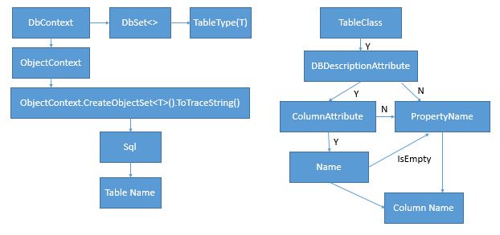
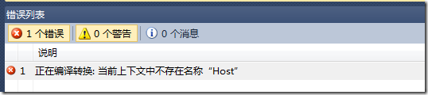
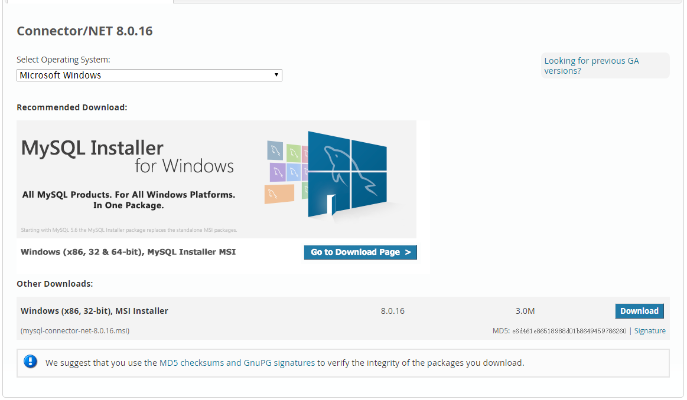

# 常见问题

#### 1、[EF Code First下支持在SQL Server中的表/字段的说明](https://www.cnblogs.com/tanglang/p/4798211.html)
> 两个方法过程如图所示：

#### 2、[使用T4模板报错：“正在编译转换；当前上下文中不存在名称Host”](https://www.cnblogs.com/xiaoxiangfeizi/p/3572295.html)

> 解决方法：将图中的False改成True就好了：

#### 3、[MySQL :: Download Connector/NET ](https://dev.mysql.com/downloads/connector/net/)
> 安装MySQL For Visual Studio和Connector/NET：

#### 4、[ No MigrationSqlGenerator found for provider 'MySql.Data.MySqlClient'](https://www.cnblogs.com/likeli/p/5775719.html)
> 解决方案：
需要在Context指定Mysql的配置文件。
[DbConfigurationType(typeof(MySql.Data.Entity.MySqlEFConfiguration))]

#### 5、[使用WEBAPI连接到MYSQL配置流程](https://blog.csdn.net/csdn102347501/article/details/79398863)

#### 6、官方 [EF6 Code First Migrations for Multiple Models](https://msdn.microsoft.com/en-us/magazine/dn948104.aspx)

# Code First 多上下文操作
> 默认情况下：
* `Enable-Migrations`
* `Update-Database`
> SqlServer 和 MySql 两个上下文配置：
* `Enable-Migrations -ContextTypeName DBDescriptionUpdater.Models.DataContext -MigrationsDirectory SqlServerMigrations`
* `Enable-Migrations -ContextTypeName DBDescriptionUpdater.Models.MySqlDataContext -MigrationsDirectory MySqlMigrations`
* 为了便于区分两个上下文的配置，可将两个`Configuration`类名称分别改为`SqlServerConfig`和`MySqlConfig`
* 其次还要注意 entityFramework 节点中 `provider` 的配置
* `Add-Migration Initial -ConfigurationTypeName SqlServerConfig`
* `Add-Migration Initial -ConfigurationTypeName MySqlConfig`
* `Update-Database -ConfigurationTypeName SqlServerConfig`
* `Update-Database -ConfigurationTypeName MySqlConfig` 
